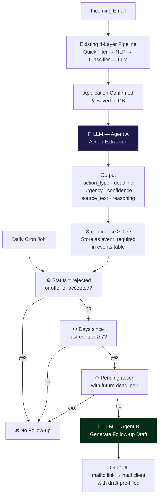

Follow-up Automation & Action Extraction for Job Applications
Your existing project (Orbit) ingests job-related emails, filters noise, classifies application stages, and stores structured data for a dashboard view.
Two real problems remain unsolved:
Users forget to follow up on job applications after 7–14 days of no response.
Job emails often contain implicit actions (assessments, interviews, document uploads) that users miss or misinterpret.
Your task is to design and implement an AI Agent that addresses both problems in a reliable, explainable, and production-oriented way.

Problem Statement
Users receive a high volume of unstructured job-related emails. These emails:
Contain implicit or explicit actions the applicant must perform
Arrive asynchronously and are easy to miss
Require judgment, not just keyword matching
Additionally, users rarely remember to follow up on applications where no response has been received after a reasonable period.

Objective
Design and implement a single AI Agent (or two cooperating agents) that:
Extracts actionable tasks from job-related emails
Decides when a follow-up is appropriate for an application
Generates a context-aware follow-up email draft
Outputs structured, auditable results suitable for downstream systems
This should be an extension of Orbit. Think about the best and least effort way to implement this in your project. 
Core Tasks
Part A: Action Extraction Agent
Goal
Convert unstructured job emails into explicit, structured actions for the applicant.
Input
Raw email body (plain text)
Optional metadata:
Company name
Role
Email timestamp
Agent Responsibilities
The agent must:
Identify whether the email contains any applicant action
Extract all relevant actions
Normalize them into a structured format
Reject false positives (newsletters, marketing, generic updates)
Supported Action Types
online_assessment
interview_scheduling
document_upload
coding_test
general_response_required
Required Output Schema
{
  "email_id": "string",
  "actions": [
    {
      "action_type": "online_assessment | interview_scheduling | document_upload | coding_test | general_response_required",
      "deadline": "ISO-8601 timestamp | null",
      "urgency": "low | medium | high",
      "confidence": 0.0,
      "source_text": "exact excerpt from email",
      "reasoning": "short explanation of why this was extracted"
    }
  ],
  "is_job_related": true
}

Constraints
If no deadline is present, the agent must infer urgency
If the email is not job-related, return is_job_related = false
Confidence scores should reflect uncertainty honestly

Part B: Follow-up Decision & Drafting Agent
Goal
Determine whether a follow-up is appropriate and what to say.
Input
Application record:
Company
Role
Application stage (Applied / OA / Interview / Offer / Rejected)
Last interaction timestamp
Extracted actions (from Part A)
Current date
Agent Responsibilities
Decide whether a follow-up should be sent
Justify the decision
If yes, generate a professional follow-up email draft
Follow-up Rules (Minimum)
Follow-up only if:
No response for N days (default: 7–14)
Application stage is not Rejected or Offer
Do not follow up if:
An action is still pending and deadline hasn’t passed
A rejection is detected
Required Output Schema
{
  "application_id": "string",
  "should_follow_up": true,
  "days_since_last_contact": 10,
  "decision_reason": "No response since application submission and no pending actions",
  "email_draft": "Dear Hiring Team, ..."
}

Follow-up Email Requirements
Personalized (company, role, date)
Polite and concise
Professional tone
No assumptions or pressure

Technical Expectations
Architecture
You may choose one of the following:
Single agent with multi-step reasoning
Two cooperating agents (Action Agent → Follow-up Agent)
You should clearly explain:
Where LLMs are used
Where deterministic logic is used
Why
Stack (Flexible)
Language: Python or JavaScript
Frameworks: FastAPI / Node (optional)
LLMs: Any (OpenAI, open-source, mocked)
Datastores: Mocked or real (Postgres / Mongo optional)
Production readiness > completeness.

Deliverables
Two things we care about the most for this assignment:
A low level architecture design for this agent. This can be handwritten, drawn on a whiteboard, any way works as long as I can see how you were thinking about the architecture
A working demo of this agentic feature 

Final Note
Some aspects of this take home assignment are intentionally left ambiguous. I’d love to have a submission before the end of the week due to the extremely competitive nature of the hiring process. If you’ve any questions feel free to write to me at siddhant@amatyaa.com.

I can’t wait to review your assignment! 

Fair point. Here's the trimmed version — whiteboard-friendly, still hits everything he asked for:

**What this keeps:**
- 🤖 vs ⚙️ distinction is still explicit — answers his "where LLM vs deterministic and why" question
- Both agents clear
- Three deterministic gates before LLM in Agent B
- Output fields visible but not bloated

**What got cut:**
- Existing pipeline internals (one box is enough)
- Individual status names in gate boxes
- UI panel detail
- Confidence discard branch

This fits a whiteboard comfortably. Everything that matters to him is still there.